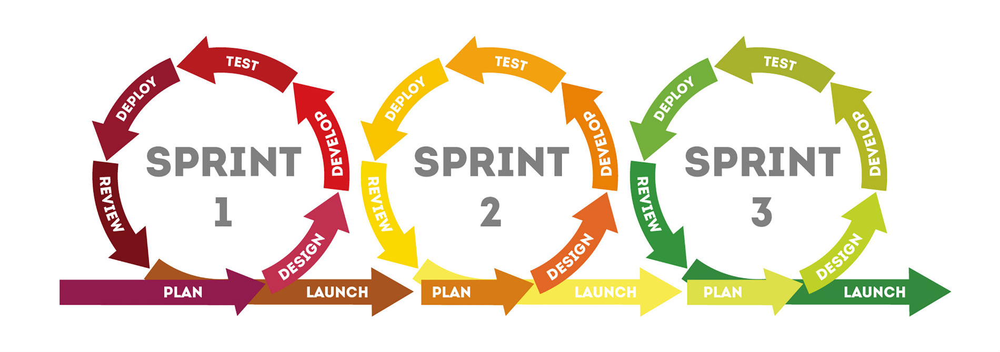

### Основные этапы тестирования мобильных приложений

Чтобы обеспечить успешную разработку любого приложения, специалист-тестировщик должен принимать участие во всех этапах разработки – от создания концепции и анализа требований, до создания спецификаций тестирования и выпуска готового продукта. 

Что бы ни делали разработчики, как бы ни трудились маркетологи и менеджеры, без контроля качества все может рухнуть в черную дыру.

Если выложить приложение, в котором тьма ошибок, и куча багов, то пользователи оставят кучу гневных отзывов и низкие оценки. Другие зайдут, увидят и даже не станут скачивать.

**Этап №1: проверка документации**

Это первое, что должен проверять тестировщик. В категорию входят различные навигационные схемы, диаграммы и другие аспекты, образующие внешний вид приложения. Иными словами, на данном этапе проводится анализ требований к программному обеспечению.

**Этап №2: проверка функциональности мобильного приложения**

Мануальщик выполняет все предусмотренные функции и анализирует исправность их работы. Чем больше параметров в приложении – тем больше уходит времени на их проверку и отладку.

Это тестирование проверяет, работает ли заложенный функционал в соответствии с предъявленными требованиями. В рамках функционального тестирования обязательно провести следующие  проверки: 
- Тестирование процесса установки;
- Эксплуатационное тестирование;
- Тестирование возможности обновлений;
- Тестирование процесса регистрации и авторизации;
- Тестирование специфических для устройства функций;
- Тестирование отправки и получения сообщений об ошибках;
- Тестирование ресурсов: использование памяти, автоматическое освобождение ресурсов и т.д.;
- Тестирование сервисов: функционирование как в режиме онлайн, так и в автономном режиме.

Какие аспекты подлежат обязательному тестированию:

- запуск и выключение ПО;
- исправность интерфейса (не должны «вылетать» ошибки);
- доступ к административному разделу.
Таким образом, тестировщик проверяет, сможет ли пользователь выполнить операции, предусмотренные в приложении. Тестируется каждая иконка по отдельности.

Также смотрят на такие моменты:

- Как ведет себя приложение, если пользователю звонят. Переходит ли оно в фоновый режим. Для этого тестировщики берут другой телефон и звонят на тестируемый с запущенным приложением.
- Тестирует, приходят ли человеку смс, когда он пользуется приложением, сохраняет ли их телефон.
- Смотрят, как работают кнопки для работы с соцсетями.
- Проверяют, дружит ли приложение с разными платежными системами.
- Тестируют нормально ли там все прокручивается на страницах.
- Убеждаются, что пользователям придут сообщения о ошибках, если что–то пойдет не так. Например, «ошибка сети», если соединение с интернетом оборвется внезапно
- Проверяют, не воюет ли приложение с другими, не забирает ли их память.

**Этап №3: проверка юзабилити**

Это тестирование показывает степень удобства приложения для пользователя. Ключевой элемент здесь — пользовательский опыт, ведь разрабатывается приложение именно для конечных пользователей. Обязательно нужно проверить навигацию по элементам и весь контент. Протестировать меню, кнопки, закладки, настройки.
Юзабилити подразумевает и применение бета-тестирования: когда перед выпуском приложения его подвергают эксплуатации реальных пользователей. Такое тестирование проводится как форма внешнего приемочного тестирования с целью получить отзывы рынка. Иными словами, определяется КПД. На что нужно обратить внимание:

- расположение и размер кнопок/иконок, например, проверяют, все ли кнопки в приложении нормального размера. А если пальцы крупные, человек сможет нажать? Что пользователь сразу находит нужную кнопку и не путается;
- многозадачность приложения;
- модульная навигация, ;
- цветовая гармония;
- читабельный шрифт, проверяют, все ли тексты в приложении пользователь видит, находят оптимальный шрифт;
- скорость возобновления после сбоя;
- синхронизация компонентов. Тестируют работу систем масштабирования: может ли пользователь что–то увеличить на экране приложения, а потом уменьшить, если нужно;
- возможность отмены действия, пользователь может отменять свои действия, возвращаться на предыдущие экраны.

На данном этапе также уделяется внимание дизайну. Он должен быть неброским и визуально приятным.

**Этап №4: проверка пользовательского интерфейса**

Тестирование ПИ необходимо для того, чтобы обеспечить соответствие графической картинки и специфики ПО. Тестировщик проверяет, как функционирует программа на экранах с разным расширением. Также уделяется внимание общему макету приложения: реклама не должна перекрывать кнопки, иконки не должны быть «плавающими» и пр.

Надо проверить функциональность, безопасность, удобство, производительность приложения и учесть все детали: от смены размера шрифта и до параллельного использования с другими программами. Можно ли свернуть текущее приложение и зайти в другое? Что ожидается от приложения при таких действиях?
Следует качественно проверять навигацию по его элементам и контент, меню, опции, кнопки, закладки, историю, настройки и навигацию приложения.

У нативных приложений есть возможность использовать другие функции устройства.
Например, приложение, которому нужен доступ к микрофону, на iOS обязательно запрашивает разрешение.

**Этап №5: проверка совместимости**

На данном этапе необходимо протестить программу на разных устройствах.
Его проводят, чтобы убедиться, что приложение отлично ведет себя на разных устройствах, работает одинаково хорошо и на телефоне, и на планшете, на разных версиях операционной системы, с разным подключением к интернету.
Обращается внимание на конфигурацию ОС, а также браузерную, сетевую. Таким образом, приложение будет работать на девайсах с Гугл Хром, Опера, Файрфокс и пр. Учитывается тип устройства и согласуются с ПО его параметры.

Особенно проверяют такие моменты:

- Что текст и иконки приложения не выходят за рамки экрана.
- Что текст легко читается на экранах разного размера.
- Что разные функции устройства работают при включенном приложении.

Так как конфигураций и сценариев тут может быть очень много, процесс тестирования совместимости стараются максимально автоматизировать.

**Этап №6: проверка производительности**

На данном этапе тестировщик анализирует стабильность работы приложения (отсутствие ошибок и багов), скорость реакции на задачи, и проверяет, какую нагрузку способно выдержать ПО. Также на данном этапе определяется, сколько пользователей одновременно могут работать с приложением.

Здесь можно выделить 3 основных направления:
- Производительность устройства
Показывает насколько стабильно ПО функционирует на девайсах с различными параметрами и помогает убедиться, что пользователи не столкнутся с задержками или потерей данных во время использования мобильных приложений. К примеру, потенциально проблемным местом для продукта является потребление памяти и расход заряда батареи. Также на этом этапе проверяется скорость работы приложения.
- Производительность сервера
Этой проверкой можно узнать, насколько оперативно отвечает сервер и обрабатываются данные.
- Производительность сети
Основные тестируемые параметры этого уровня – задержка и пропускная способность. Работу приложения следует проверять подключением к различным сетям (3G-, 4G- и 5G-сети).

**Этап №7: проверка безопасности**

Речь идет об анализе безопасности системы – т.е. определении рисков, связанных с эксплуатацией программного обеспечения. Задача на данном этапе – защитить программу от взлома и «слива» информации, насколько защищено приложение от хакерских атак, вирусов, взломов, доступа к данным пользователя посторонними людьми.

- Первым делом проверяют, защищены ли данные пользователей, пароли, номера банковских карт. Не могут ли взломщики подобрать данные для входа.
- Смотрят, чтобы приложение не давало доступ к секретному контенту пользователя без проверки прав доступа.
- Тестируют, требует ли система безопасности придумать надежный пароль, а не 12345.

**Этап №8: проверка локализации**

Любое приложение должно работать в режиме реального времени. Это значит, что перед запуском необходимо проверить соответствие дат, времени.
В процессе тестирования локализации, особое внимание уделяется контенту и пользовательскому интерфейсу. А именно:
- Какие языки поддерживает приложение;
- Точность перевода различных элементов интерфейса;
- Точность перевода документации и разделов FAQ/Help;
- Корректность текущей даты, времени и т.д.

**Этап №9: бета-проверка**

На данном этапе программу можно заливать в сеть и приглашать желающих ею воспользоваться. Цель бета-тестирования – узнать реальные отзывы людей, проанализировать их жалобы и пожелания. Пользователи ставят оценку (условную) и выносят «вердикт» - полезное приложение или нет.

**Заключительный этап: сертификация**

Сертификационное тестирование подтверждает, что ПО соответствует требованиям интернет-магазинов. В зависимости от того, где программа будет опубликована, разработчик должен подать заявление на проверку своей работы. Как правило, внимание уделяется Google Play. Если приложение прошло проверку в этом сторе – оно будет принято везде.
